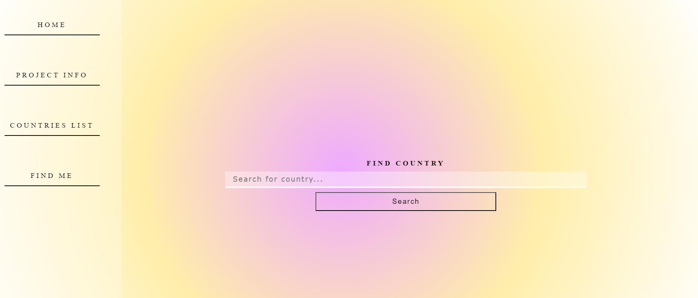

# Country API Project

This project makes use of [REST Countries](https://restcountries.com/) api endpoints to create a decent web application. More features will be added to the project.

## Screenshot

## NOTE

The country.json file is to test api endpoints using a slice of the api so there aren't too many actual requests going to the live one. Project still in progress.

### Live Site

-[Netlify Site](https://countrywikiapp.netlify.app)

## Technologies Used

- Semantic HTML
- CSS - Using SASS preprocessor
- JavaScript
